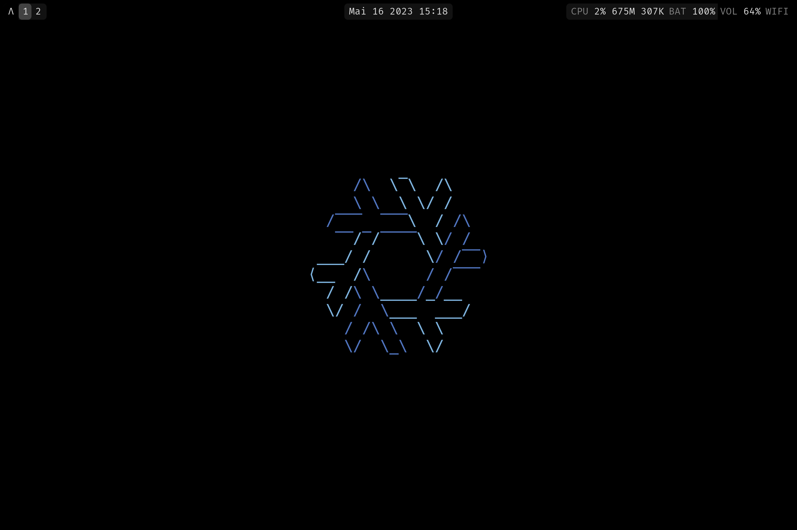

# sntx's NixOS Flake

<!-- intro -->

Welcome to my flake!
My system configurations equivalent of dotfiles.

---

<!-- screenshots -->


<p style="text-align: center;">
Screenshot of the Desktop
</p>

## Overview

This flake splits the aspects of my system configuration into different modules
which in turn can be assigned to multiple system definitions.

The structure of the modules is as follwos:

* A system is defined by its `hostname` and one enabled `myHardware` module.
It can have one `myDesktops`, multiple `myProfiles`, `myPrograms` and
`myServices` modules and optionally one `myThemes` module.
* `myDesktops` contains modules for desktop environments.
* `myProfiles` is a special module since it links to modules in `myPrograms` and
`myServices`. you can think of it as a collection of modules for a specific purpose.
* `myPrograms` & `myServices` contain applications that either run as a program
or a service.
* `myThemes` is a module that provides overrides to achive a specific look for a
system.

## Installation

1. Read this [installation guide](https://nixos.wiki/wiki/NixOS_Installation_Guide)
from the NixOS Wiki. If you want to use BTRFS, then I'd recommend following
[this post from kolaente](https://blog.kolaente.de/2021/11/installing-nixos-with-encrypted-btrfs-root-device-and-home-manager-from-start-to-finish/).
If you are installing remotely to the Hetzner Cloud, take a look at this
[Gist](https://gist.github.com/cyber-murmel/8b726b45047907a842a9dc9db2618b0a).
1. After reaching a minimal working system, duplicate the `-template-` in
`./modules/hardware` copy the contents of your
`/etc/nixos/{configuration.nix,hardware-configuration.nix}` into it after
renaming the files/placeholder-names to match your new system.
1. To then switch the configuration to this flake, run:

  ```sh
  sudo nixos-rebuild boot --flake sourcehut:~sntx/flake#<new_system_name>
  reboot
  ```

## Features

TODO

## Special Thanks

This config is inspired by and partially based on [dunklecat's nixos-config](https://git.sr.ht/~dunklecat/nixos-config).

<!-- badges -->

<p style="text-align: center;">
<a href="https://builtwithnix.org"></a>
</p>
